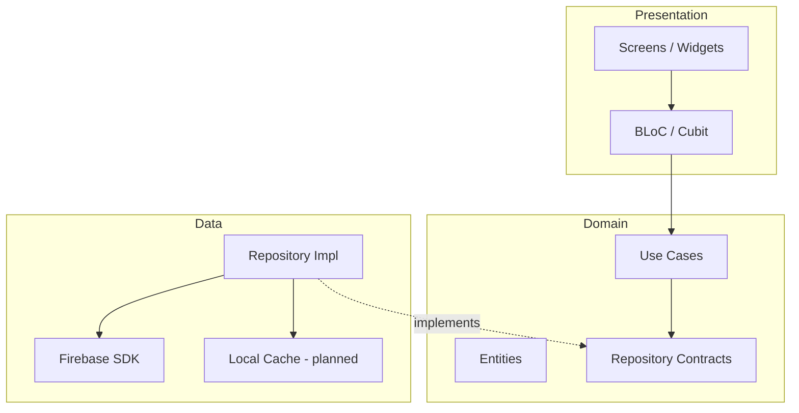

# Arquitetura

Visão da arquitetura do **Travels App** — aplicativo Flutter para estruturar roteiros de viagens.

## Visão geral



## Estrutura de pastas

```
travels_app/
├── lib/
│   ├── main.dart                 # Entry point
│   ├── app/
│   │   └── travels_app.dart      # MaterialApp + GoRouter
│   ├── core/
│   │   ├── di/                   # GetIt (planned)
│   │   ├── ds/                   # Design system
│   │   ├── routes/               # AppRouters enum
│   │   └── utils/                # Helpers (planned)
│   └── feature/
│       ├── splash/               # Splash com Lottie
│       ├── home/                 # Tela inicial
│       ├── itinerary/            # Roteiros (planned)
│       ├── destinations/         # Destinos (planned)
│       └── auth/                 # Autenticação (planned)
├── assets/                       # Lottie, imagens
├── docs/                         # Documentação
└── .cursor/rules/                # Roles para IA
```

## Stack tecnológica

| Camada | Tecnologia | Versão alvo |
|--------|------------|-------------|
| Framework | Flutter | 3.44.x (stable) |
| Linguagem | Dart | 3.12.x |
| Estado | flutter_bloc | ^9.x |
| Navegação | go_router | ^17.x |
| DI | get_it | ^9.x |
| Backend | Firebase Auth, Core, Storage | ^6.x / ^4.x / ^13.x |
| Tipografia | google_fonts | ^8.x |
| Animação | lottie | ^3.x |

## Navegação atual

| Rota | Nome | Tela |
|------|------|------|
| `/` | `splash` | SplashScreen |
| `/home` | `home` | HomeScreen |

Novas rotas devem ser adicionadas ao enum `AppRouters` e registradas em `travels_app.dart`.

## Design system

Tokens centralizados em `lib/core/ds/`:

- **DSColor** — paleta de cores da marca
- **DSFontStyle** — estilos tipográficos (Roboto, DM Sans)
- **basic_tokens/** — tamanhos, pesos, raios, sombras

Componentes reutilizáveis devem ser criados em `lib/core/ds/components/` conforme o app evolui.

## Princípios

1. **Feature-first** — cada funcionalidade é um módulo vertical
2. **Separation of concerns** — UI não acessa Firebase diretamente
3. **Incremental complexity** — começar com presentation, extrair domain/data quando necessário
4. **Testability** — use cases e BLoCs devem ser testáveis sem widget tree

## Próximos passos arquiteturais

1. Configurar `core/di/` com GetIt
2. Inicializar Firebase com flavor/env config
3. Criar módulo `feature/itinerary` com entidades base
4. Adicionar camada de cache local (Hive ou Drift) para uso offline
